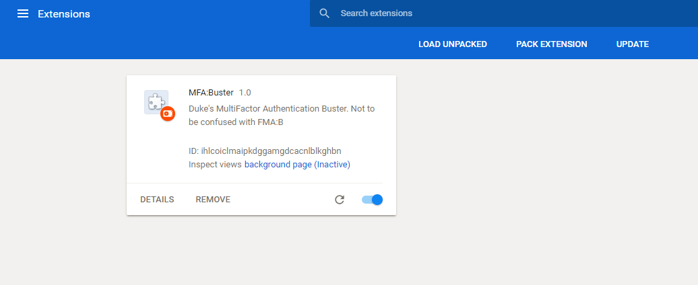
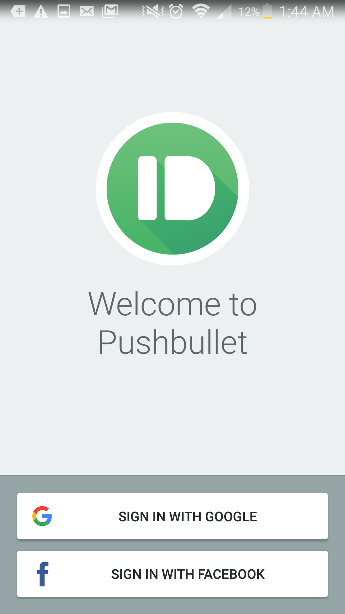
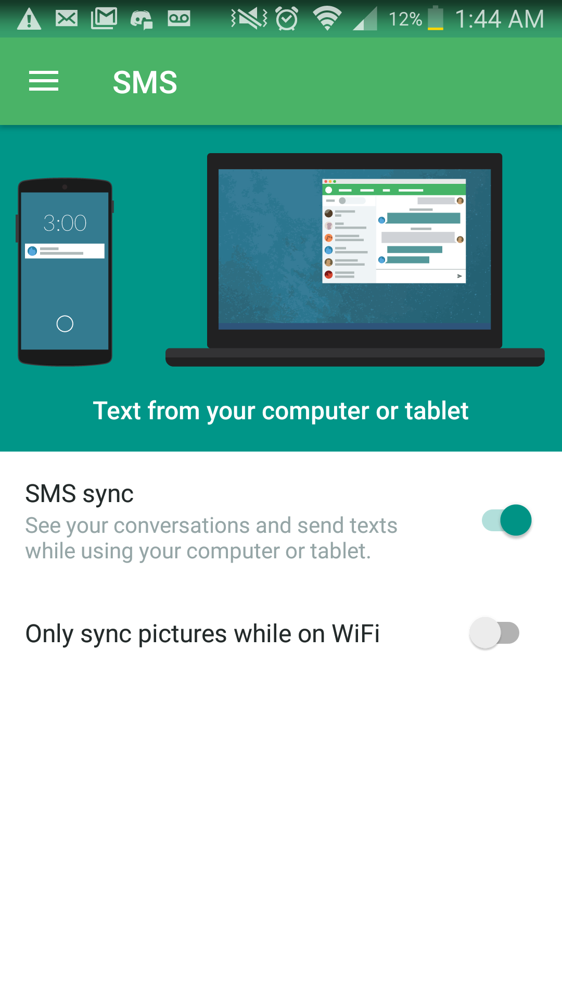
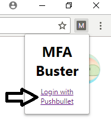
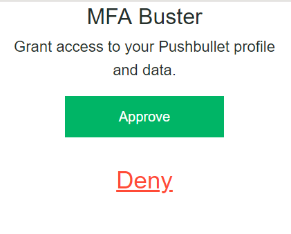
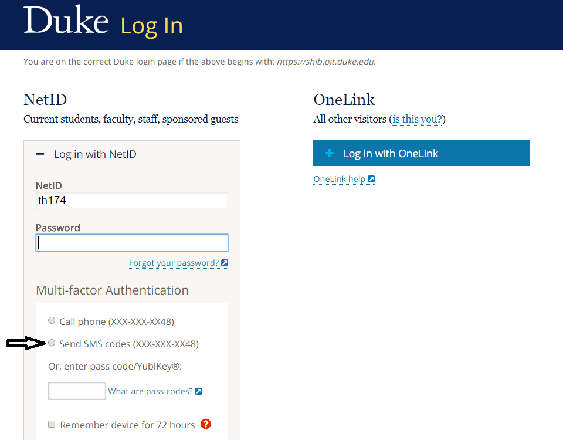
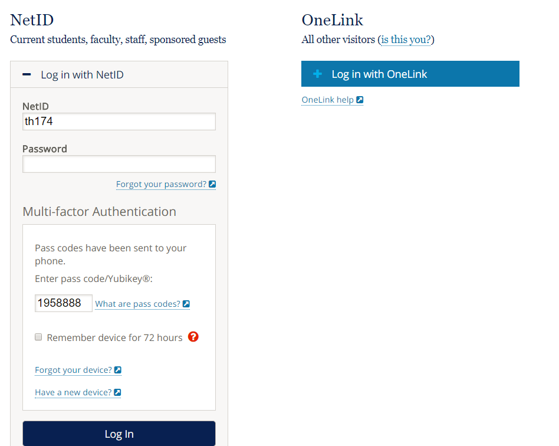

# MFA-Buster
MFA:Buster automatically performs Duke University Shibboleth Multifactor Authentication through SMS through a Google Chrome extension.

## Usage Instructions

1. [Download the chrome extension here](MFAB.crx). Drag and drop the .crx chrome extension file onto your chrome extensions page to install it. 

2. Download and install the Pushbullet mobile app for [iOS](https://itunes.apple.com/us/app/pushbullet/id810352052) or [Android](https://play.google.com/store/apps/details?id=com.pushbullet.android). Once it's installed, login using a Google or Facebook account. 

3. Enable SMS Sync in the Pushbullet mobile app. You can find this option under Menu -> SMS -> SMS Sync. 

4. Click the MFA Buster extension in the Chrome toolbar to open the extension popup. Then click the Login with Pushbullet link. 

5. Click the green Approve button to grant access permissions to MFA Buster. Login to Pushbullet using a Facebook or Google account. Make sure to use the same one used to log into your phone in step 2. 

6. Congratulations, you have successfully set up MFA Buster! (I hope) Now visit Duke's Shibboleth login portal, and click on "Send SMS Codes" under Multi-factor Authentication. 

7. Wait approximately 30 seconds, or however long it takes for your phone to receive the SMS passcode. Once the SMS passcode has been received on your phone, it will be forwarded to MFA Buster, which will automatically fill in the passcode field in Shibboleth. 

8. For any additional logins to Duke services, repeat steps 6 and 7.
